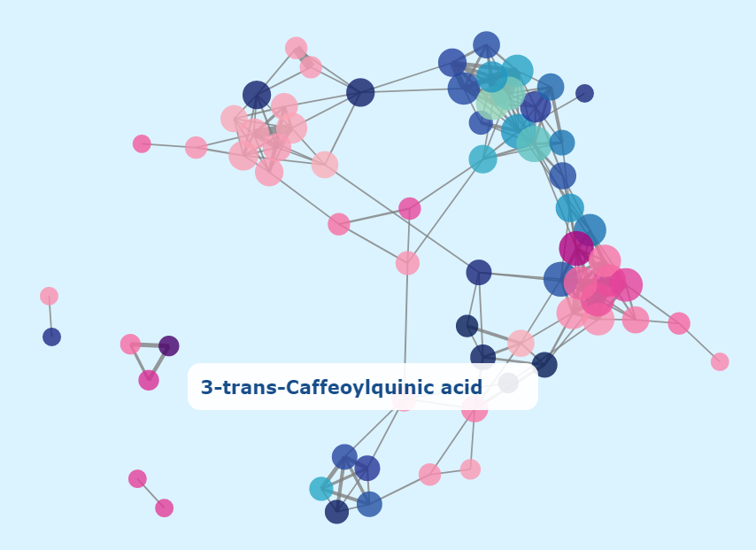
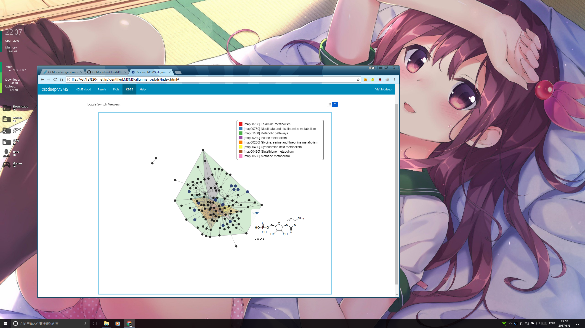

# KEGG-metabolite-network

D3.js network style comes from https://github.com/whichlight/reddit-network-vis

## Product Application

> Data report generated from biodeepMSMS ``LC_MS`` small molecule identification analysis software. Coloured polygon stands for the KEGG pathway and the node is the KEGG compound which was identified from the biodeepMSMS analysis program.